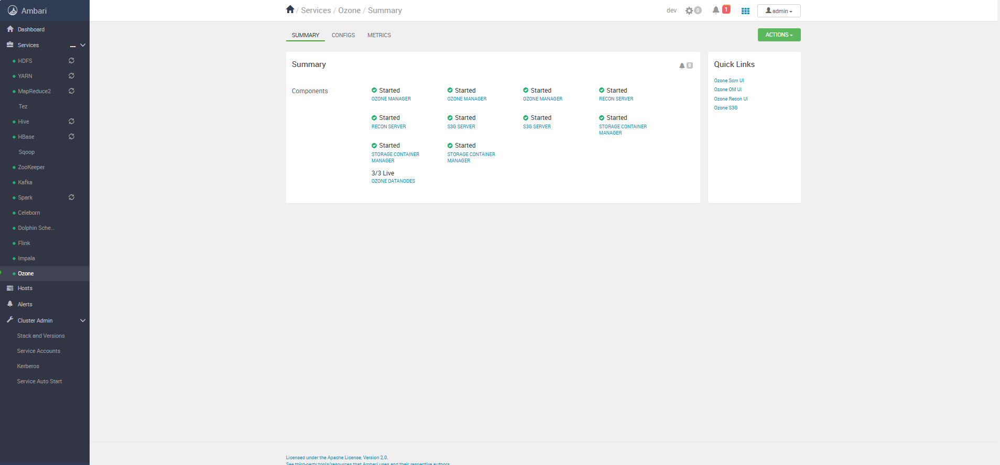
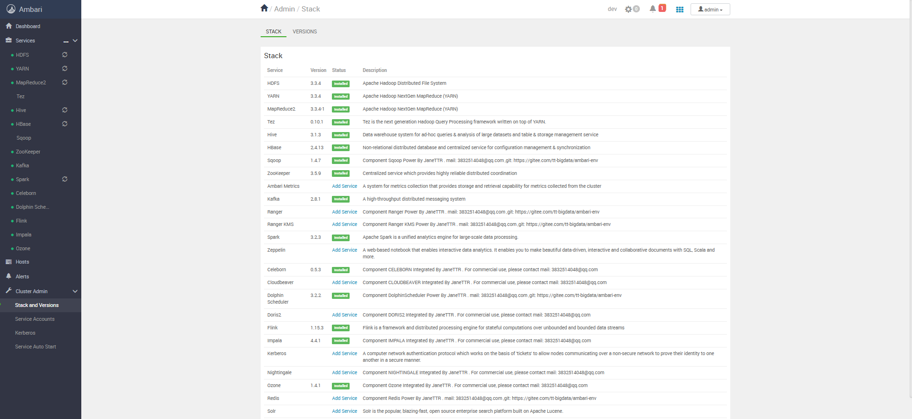

# Ambari+Bigtop 部署解决方案 🚀✨

## 项目简介 📚

本项目提供了一个部署 Ambari+Bigtop方案，帮助用户轻松搭建大数据平台。

## 下载地址

组件下载地址：

1. http://www.hdp.link/

2. https://hub.docker.com/r/bigtop/slaves

## 最新动态 📢

🎉 **我们的版本已支持 Doris2.1.7** 🎉  
欢迎大家下载安装并体验！🎯




🚀 **限时优惠**：现在关注我们的微信公众号，还可以限时领取**知识星球优惠券** 🎁，抓紧机会，福利多多，等你来拿！  
扫码关注，获取更多技术干货与独家优惠👇：
<div align="center">
    
    <br/>
    <b>请关注我们的微信公众号 📲</b>
</div>

---

## 快速导航 📑

| **快捷导航**      | **链接地址**                                  | **备注** |
|---------------|-------------------------------------------|--------|
| **源代码**       | -                                         | -      |
| Ambari-env    | https://github.com/TtBigdata/ambari-env   | Gihub  |
| Ambari-env    | https://gitee.com/tt-bigdata/ambari-env   | Gitee  |
| Ambari-Bigtop | https://gitee.com/tt-bigdata/ambari-      | Gitee  |
| **集成技巧**      | -                                         | -      |
| Ambari-index  | https://gitee.com/tt-bigdata/ambari-index | Gitee  |

---

## 版本说明

- 适配环境
  - centos 7.9.2009
  - jdk 1.8
  - python2

---

## 安装步骤 🛠️

### 1. 系统要求 📋

确保你的系统满足以下条件：

| **系统要求** | **描述**                     |
|----------|----------------------------|
| 操作系统     | Linux（推荐 CentOS7.9） 🐧     |
| 内存       | 至少 24GB 💾                 |
| 硬盘空间     | 至少 300GB 📦                |
| 软件要求     | Docker 和 Docker Compose 🐳 |

### 2. 安装指南 🚀

   ```bash
   docker-compose -f docker-compose.yaml up -d
   ```

---

### 使用方法 📈

```bash
# 进入容器镜像内部

docker exec -it XXX /bin/bash

```

#### 一键启动（供日常开发测试，不要用于生产）

```bash
  source  /scripts/install/onekey_start.sh 
```

---

### 许可证 📜

本项目采用 [Apache 2.0](LICENSE)。


