# Ambari+Bigtop 一站式编译和部署解决方案 🚀✨

## 项目简介 📚

本项目提供了一个 **一站式解决方案**，从编译到部署 Ambari+Bigtop，帮助用户轻松搭建大数据平台。通过该项目，你可以 **自己动手完成源码编译
**，体验一键部署的便利！💻🚀

**关注该项目**，你将能够获得完整的源代码 📂，通过该代码自由定制和扩展项目 🛠️。

- 如果你想预览更多内容 📖，可以访问我的 **CSDN 博客**[https://ttbigdata.blog.csdn.net/](https://ttbigdata.blog.csdn.net/)
  ，这里会定期分享项目相关的简要预览和技术干货。

- 如果你需要与其他开发者进行技术交流 💬，解决在项目使用中的问题，欢迎加入我们的**QQ群**，我们会为你提供专业指导，扫清所有障碍！🎯
  点击链接加入群聊【ambari-env（Ambari+Bigtop）】：https://qm.qq.com/q/COMpqiEVLq

---

## 最新动态 📢

🎉 **我们的版本已支持 DolphinScheduler 3.2.2** 🎉  
欢迎大家下载安装并体验！🎯

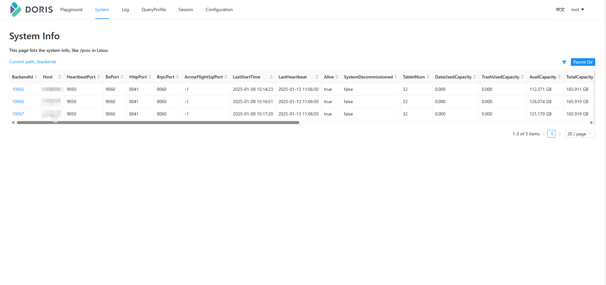

🎉 **最新`v1.0.3`编译包请扫描公众号免费获取** 🎉

🚀 **限时优惠**：现在关注我们的微信公众号，还可以限时领取**知识星球优惠券** 🎁，抓紧机会，福利多多，等你来拿！  
扫码关注，获取更多技术干货与独家优惠👇：
<div align="center">
    
    <br/>
    <b>请关注我们的微信公众号 📲</b>
</div>

---
## 快速导航 📑

| **快捷导航**      | **链接地址**                                  | **备注** |
|---------------|-------------------------------------------|--------|
| **源代码**       | -                                         | -      |
| Ambari-env    | https://github.com/TtBigdata/ambari-env   | Gihub  |
| Ambari-env    | https://gitee.com/tt-bigdata/ambari-env   | Gitee  |
| Ambari-Bigtop | https://gitee.com/tt-bigdata/ambari-      | Gitee  |
| **集成技巧**      | -                                         | -      |
| Ambari-index  | https://gitee.com/tt-bigdata/ambari-index | Gitee  |

---
### 版本说明

- v1.0.4 支持情况

| **组件名称** | **组件版本** | **env版本** | 时间  |
|----------|----------|-----------|-----|
| Doris    | 待定       | 1.0.4     | 待定  |
| 其他待定     | 待定       | 1.0.4     | 待定  |

- v1.0.3 支持情况

| **组件名称**         | **组件版本** | **env版本** | 时间         |
|------------------|----------|-----------|------------|
| Phoenix          | 5.1.2    | 1.0.3     | 2024/10/15 |
| Dolphinscheduler | 3.2.2    | 1.0.3     | 2024/10/15 |

- v1.0.2 支持情况

| **组件名称** | **组件版本** | **env版本** | 时间              |
|----------|----------|-----------|-----------------|
| Redis    | 7.4.0    | 1.0.2     | 2024/09/10(已支持) |

- v1.0.1 支持情况

| **组件名称** | **组件版本** | **env版本** | 时间              |
|----------|----------|-----------|-----------------|
| Sqoop    | 1.4.7    | 1.0.1     | 2024/08/15(已支持) |
| Ranger   | 2.4.0    | 1.0.1     | 2024/08/15(已支持) |

- v1.0.0 支持情况 （ 源bigtop3.2.0）

| **组件名称**       | **组件版本**   | **env版本** | 时间              |
|----------------|------------|-----------|-----------------|
| Zookeeper      | 3.5.9      | 1.0.0     | 2024/08/01(已支持) |
| Hadoop         | 3.3.4      | 1.0.0     | 2024/08/01(已支持) |
| Flink          | 1.15.3     | 1.0.0     | 2024/08/01(已支持) |
| HBase          | 2.4.13     | 1.0.0     | 2024/08/01(已支持) |
| Hive           | 3.1.3      | 1.0.0     | 2024/08/01(已支持) |
| Kafka          | 2.8.1      | 1.0.0     | 2024/08/01(已支持) |
| Spark          | 3.2.3      | 1.0.0     | 2024/08/01(已支持) |
| Solr           | 8.11.2     | 1.0.0     | 2024/08/01(已支持) |
| Tez            | 0.10.1     | 1.0.0     | 2024/08/01(已支持) |
| Zeppelin       | 0.10.1     | 1.0.0     | 2024/08/01(已支持) |
| Livy           | 0.7.1      | 1.0.0     | 2024/08/01(已支持) |
| ambari         | branch-2.8 | 1.0.0     | 2024/08/01(已支持) |
| ambari-metrics | branch-3.0 | 1.0.0     | 2024/08/01(已支持) |
| ambari-infra   | master     | 1.0.0     | 2024/08/01(已支持) |

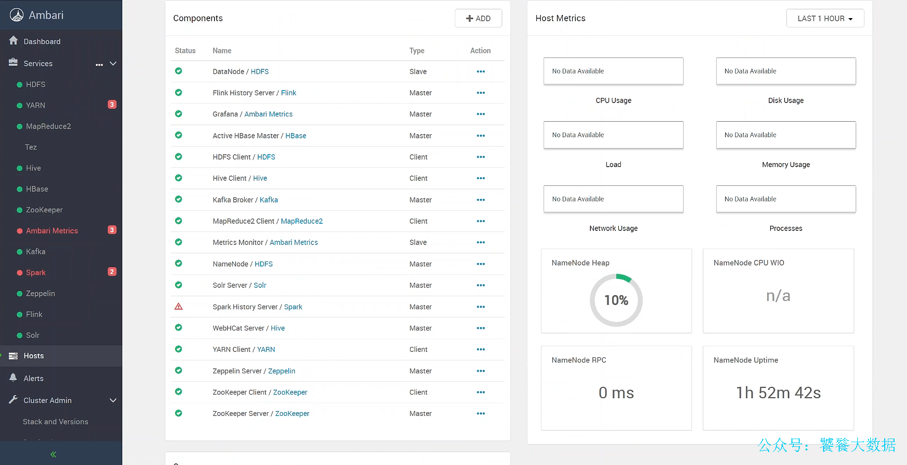

---
## 互动

> 对于1.0.4及之后的版本。大家可以邮件我，提出想法，帮助共同推进版本迭代。（如果看到消息，问必答）
>
> 流程：组件收集->技术内部探讨->公式版本演化路线->本页维护时间

---
## 功能介绍 🎯

- **一键编译**：自动化脚本轻松实现大数据集群编译部署，无需手动操作 🖱️。
- **组件集成**：支持常见大数据组件的灵活定制和集成，如 Redis、Phoenix、Dolphinscheduler 🧩。
- **详细日志和报错报告**：帮助用户快速定位和解决问题 📝。
- **未来扩展规划**：离线/实时数仓、多种分布式组件支持即将上线，敬请期待 🔮。

---

## 安装步骤 🛠️

### 1. 系统要求 📋

确保你的系统满足以下条件：

| **系统要求** | **描述**                     |
|----------|----------------------------|
| 操作系统     | Linux（推荐 CentOS7.9） 🐧     |
| 内存       | 至少 24GB 💾                 |
| 硬盘空间     | 至少 300GB 📦                |
| 软件要求     | Docker 和 Docker Compose 🐳 |

### 2. 安装指南 🚀

1. 克隆仓库：
   ```bash
   git clone https://gitee.com/tt-bigdata/ambari-env.git
   cd ambari-env
   ```

2. 运行 Docker Compose：
   ```bash
   docker-compose -f docker-compose up -d
   ```

---

### 使用方法 📈

```bash
# 进入容器镜像内部

# 方式一
docker exec -it centos1 /bin/bash

# 方式二
ssh root@localhost -p 22223
```

`"编译"`完成后，您可以通过以下命令启动和管理您的大数据集群：
#### 一键编译

```bash
  # tips:1.0.2版本以上支持
  bash  /scripts/build/onekey_build.sh 
  # 编译结果如下图：
```

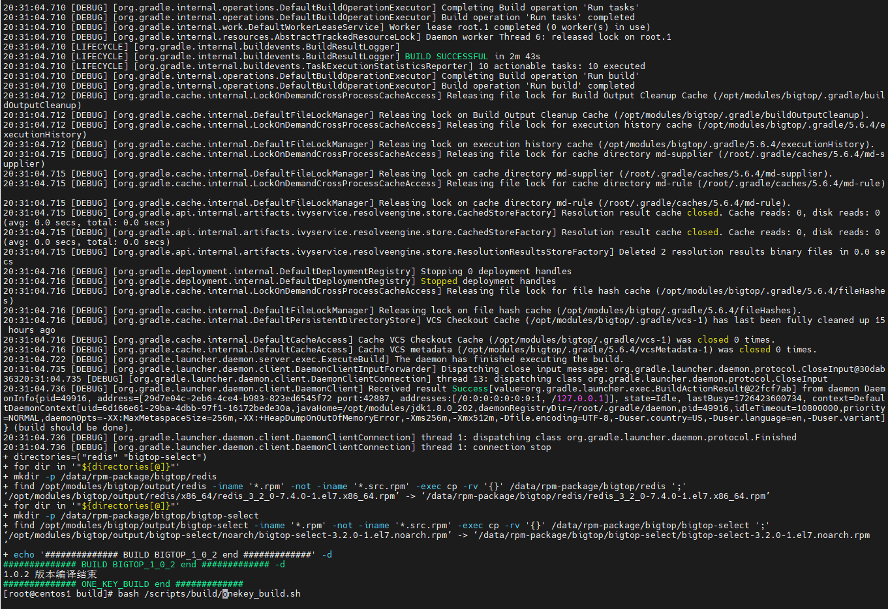


#### 一键启动（供日常开发测试，不要用于生产）

```bash
  # tips:1.0.2版本以上支持
  bash  /scripts/install/onekey_start.sh 
```

#### 独立编译

- **编译 Ambari:**

  ```bash
  bash /scripts/build/ambari/build.sh
  ```
  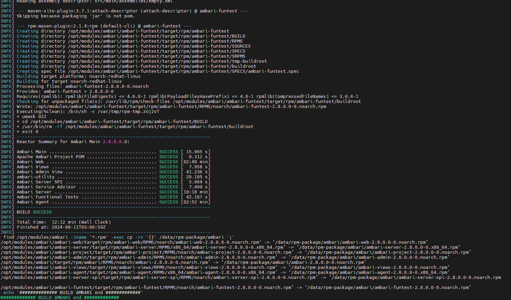
  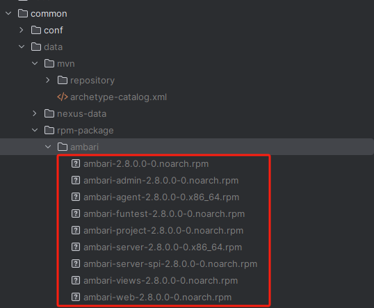

- **编译 Ambari-infra：**

  ```bash
  bash /scripts/build/ambari-infra/build.sh
  ```
  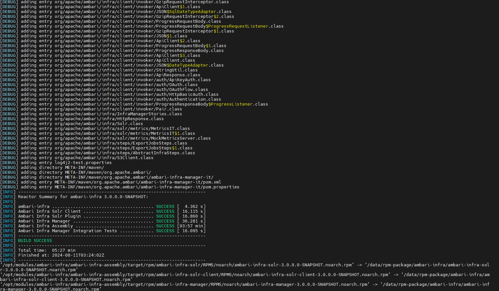
  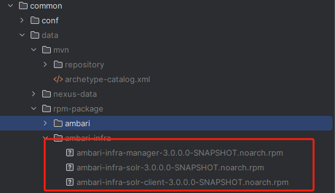

- **编译 Ambari-metrics：**

  ```bash
  bash /scripts/build/ambari-metrics/build.sh
  ```
  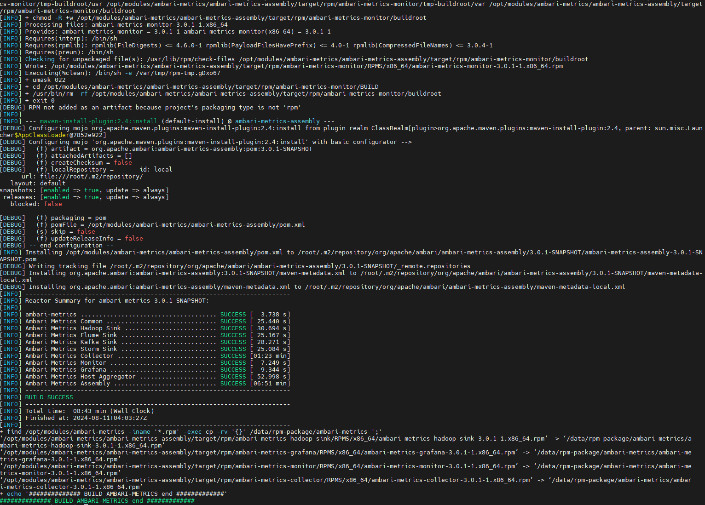
  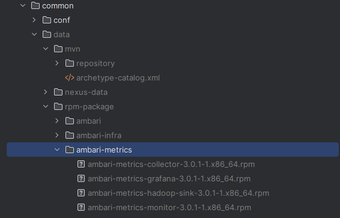
- **编译 Bigtop：**

  ```bash
  bash /scripts/build/bigtop/build.sh
  ```
  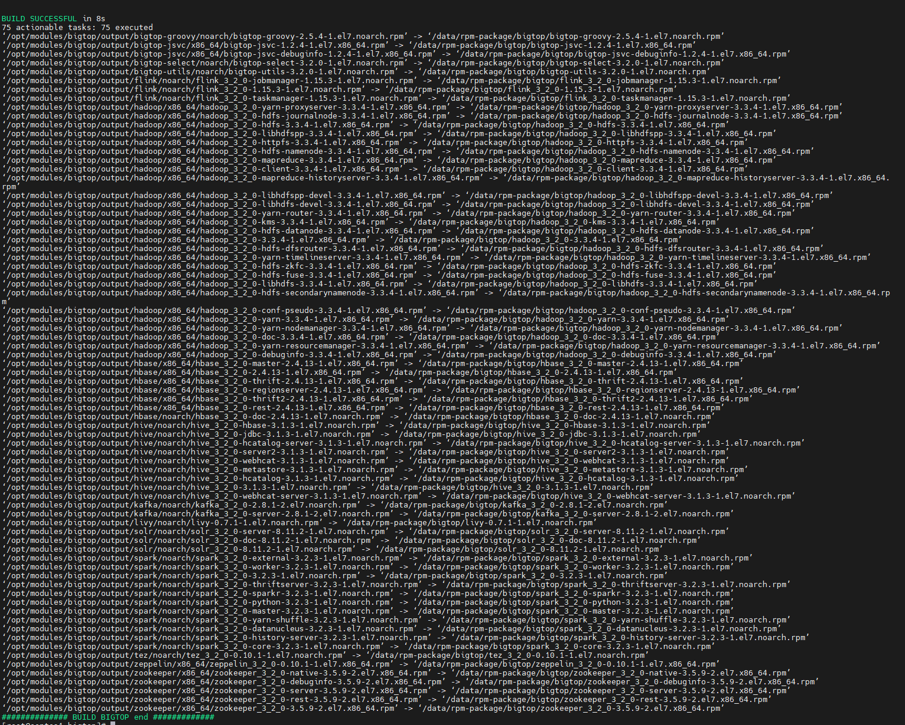
  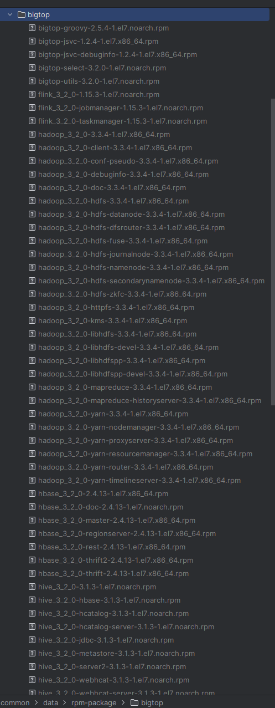
  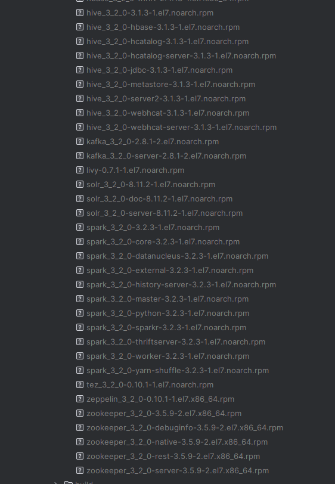

感谢您的关注与支持！🎉 如果您觉得这个项目对您有帮助，欢迎请我喝杯咖啡 ☕，以支持我继续开发和维护这个项目！感激不尽！😊


---


### 许可证 📜

本项目采用 [Apache 2.0](LICENSE)。


